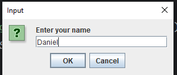
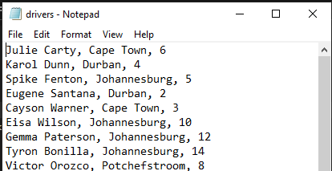
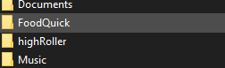
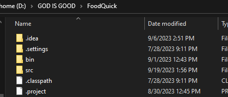

# FoodQuick
This a Java program that has a functionality sort of like Uber Eats and sorts. It works with a driver's list and it prints out an invoice in your file location.
The program runs as a normal Java program so it's going to be GUI input boxes that appear to collect your user's information and preferences.

* GUI When the program is run
  
# Requirments
* Driver's list
* Appropriate file system
* An IDE that can run the Java program. I recommend Visual Studio Code
  ### Driver's List
Your Driver's list is exponentially important to run the program this should be a txt file.
For the driver's list, it should be in the format of:

  
  * Driver's Name (After comes a COMMA).
    
  * Location, This can be in any way you want but you generally want it to be in the way the user will input the  restaurant location and also theirs (After comes a COMMA).

  * And load which is the numbers at the end of each driver's line.

### Appropriate File system

It's important to have the right system when running this program. The program was made with INTELLIJ IDEA COMMUNITY IDE so it has a library system and all, you may not find it necessary to have one but you generally should. The program is run with JDK 20.

In the parent file system the folder SRC has the food quick program which should run on a Java IDE.
